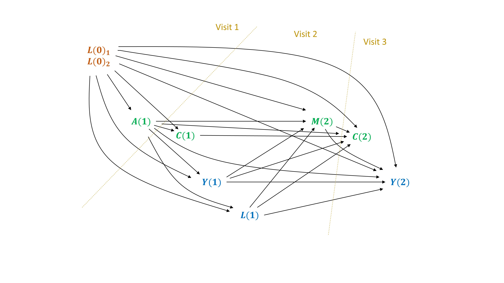

# `ltmle` package with interval censored survival data
## Setting
The `ltmle` package can be used to estimate a cumulative risk, with interval censored survival data.

Here we simulate a simple example, based on 2 intervals between 3 visits. 

  - baseline confounders $L(0)$ and the exposure of interest $A$ is measured at visit 1.
  - intermediate confounders $L(1)$ and the mediator $M$ are measured at visit 2. Death and censoring can occur before the mediator:
  - $Y(1)$ and $Y(2)$ are occurences of death between visits 1 and 2, and visits 2 and 3. 
  - $C(1)$ and $C(2)$ are censoring occuring before visit 2 and before visite 3, respectively. They will be considered as exposure variables (treatment mechanisms) and counterfactual scenarios will be emulated under "no censoring". Censoring can be informative (influenced by previous variables in the system).
  
```{r figDAG2, echo=FALSE, out.width="100%", fig.align="center", fig.cap="DAG with interval censored survival data"}
    
```

In this example, we simulate the exposure and the mediator as 3-level categorical variables. In order to implement the `ltmle` function, each one needs to be recoded by 2 dummy variables. For example: 

  - The exposure $A(1)= \{0,1,2\}$ can be recoded by 2 dummy variables ($A(1)_1$ and $A(1)_2$): 
  \begin{align*}
    A(1)_1 &= \mathbb{I}(A(1) = 1) \\
    A(1)_2 &= \mathbb{I}(A(1) = 2) \\
  \end{align*}
  and the distribution $P(a(1)) = P(a(1)_1, a(1)_2) = P(a(1)_1) \times (P(a(1)_2 \mid a(1)_1)$. We also know that if the first dummy variable $A(1)_1 = 1$, then $A(1)_2 = 0$ deterministically. However, if $A(1)_1 = 0$, then we can apply the conditional probability $P(A(1)_2 = 1 \mid L(0))$.

## Data generating function
Here is a example of a function simulating data corresponding to this DAG. 

Note, in this example, we did not add "Exposures $\times$ mediator" interaction terms in the 2 outcome models, so that the controlled direct effects is expected to be independent of the value $m$ chosen, when setting $M=m$ for Controlled Direct Effects.
```{r data_generating_surv, echo=TRUE}
rm(list = ls())

## Data generating function ----
GenerateData.CDE <- function(N) { 
  # rexpit function
  rexpit <- function (x) rbinom(length(x), 1, plogis(x))
  
  # baseline confounders L0
  L0_1 <- rbinom(N, size = 1, prob = 0.45) 
  L0_2 <- rexpit(qlogis(0.6) + log(1.5) * L0_1) 
  
  # exposure A: treatment
  A1_1 <- rexpit(qlogis(0.2) + log(0.9) * L0_1  + log(1.5) * L0_2)
  A1_2 <- ifelse(A1_1 == 1,
                 0,
                 rexpit(qlogis(0.5) + log(0.8) * L0_1  + log(2) * L0_2))
  
  # censoring C1
  C1 <- rexpit(qlogis(0.03) + log(1.4) * L0_1  + log(1.4) * L0_2 + 
                 log(1.1) * A1_1 + log(1.4) * A1_2)
  
  # death Y1
  Y1 <- rexpit(qlogis(0.05) + log(1.2) * L0_1  + log(1.5) * L0_2 + 
                 log(2) * A1_1 + log(3) * A1_2)  
  
  ### intermediate counfounders L1
  L1 <- ifelse(Y1 == 1,
               NA,
               rnorm(N, mean = 50 + (5 * L0_1) + 
                       (-3 * L0_2) + (4 * A1_1) + (10 * A1_2),
                     sd = 15))

  # mediator M2: continue treatment
  M2_1 <- ifelse(Y1 == 1, 
                 NA, 
                 rexpit(qlogis(0.4) + log(0.9) * L0_1[Y1 == 0]  + 
                          log(1.5) * L0_2[Y1 == 0] + 
                          log(1.3) * A1_1[Y1 == 0] + log(1.6) * A1_2[Y1 == 0] + 
                          log(1.02) * L1[Y1 == 0]))
  M2_2 <- rep(NA, N)
  M2_2[Y1 == 1] <- NA
  M2_2[Y1 == 0 & M2_1 == 1] <- 0
  M2_2[Y1 == 0 & M2_1 == 0] <- rexpit(qlogis(0.4) + 
                                        log(0.9) * L0_1[Y1 == 0 & M2_1 == 0]  + 
                                        log(1.5) * L0_2[Y1 == 0 & M2_1 == 0] + 
                                        log(1.5) * A1_1[Y1 == 0 & M2_1 == 0] + 
                                        log(2) * A1_2[Y1 == 0 & M2_1 == 0] + 
                                        log(1.03) * L1[Y1 == 0 & M2_1 == 0])
  
  # censoring C2
  C2 <- rep(NA, N)
  C2[Y1 == 1] <- NA
  C2[Y1 == 0 & C1 == 1] <- 1
  C2[Y1 == 0 & C1 == 0] <- rexpit(qlogis(0.03) + 
                                    log(1.4) * L0_1[Y1 == 0 & C1 == 0] + 
                                    log(1.4) * L0_2[Y1 == 0 & C1 == 0] + 
                                    log(1.05) * A1_1[Y1 == 0 & C1 == 0] + 
                                    log(1.2) * A1_2[Y1 == 0 & C1 == 0] + 
                                    log(1.01) * L1[Y1 == 0 & C1 == 0] + 
                                    log(1.1) * M2_1[Y1 == 0 & C1 == 0] + 
                                    log(1.4) * M2_2[Y1 == 0 & C1 == 0])

  # death Y2
  Y2 <- rep(NA, N)
  Y2[Y1 == 1] <- 1
  Y2[Y1 == 0] <- rexpit(qlogis(0.05) + log(1.2) * L0_1[Y1 == 0] + 
                          log(1.5) * L0_2[Y1 == 0] + 
                          log(1.5) * A1_1[Y1 == 0] + log(2) * A1_2[Y1 == 0] + 
                          log(1.01) * L1[Y1 == 0] + 
                          log(1.5) * M2_1[Y1 == 0] + log(2) * M2_2[Y1 == 0])  
                               
  df <- data.frame(L0_1 = L0_1, L0_2 = L0_2,
                   A1_1 = A1_1, A1_2 = A1_2, C1,
                   Y1 = Y1, L1 = L1,
                   M2_1 = M2_1, M2_2 = M2_2, C2,
                   Y2 = Y2)
  
  df$Y1 <- ifelse(df$C1 == 1, NA, df$Y1)
  df$L1 <- ifelse(df$C1 == 1, NA, df$L1)
  df$M2_1 <- ifelse(df$C1 == 1, NA, df$M2_1)
  df$M2_2 <- ifelse(df$C1 == 1, NA, df$M2_2)
  df$C2 <- ifelse(df$C1 == 1, NA, df$C2)
  df$Y2 <- ifelse(df$C2 == 1, NA, df$Y2)

  return(df)
}

## Generate 1 data frame, named df2 ----
set.seed(1234)
df2 <- GenerateData.CDE(N = 10000)
write.csv2(df2, "data/df2.csv")

## Import data df2
df2 <- read.csv2("data/df2.csv")
```

## Inspect the data generated
Let's inspect the data.
```{r inspect_df2, echo=TRUE, eval = FALSE}
View(df2)
df2 |> 
  with(table(A1_1, A1_2)) # distribution of the exposure

df2 |> 
  subset(subset = (C1 == 1)) |>
  summary() # 519 censored after C1

df2 |> 
  subset(subset = (C1 == 0)) |>
  summary() # distribution of variables uncensored after C1

df2 |> 
  subset(subset = (C1 == 0 & Y1 == 1)) |>
  summary() # among uncensored participants at C1, 1319 death at Y1

df2 |> 
  subset(subset = (C1 == 0 & Y1 == 0)) |>
  summary() # distribution of variables uncensored at C1 and alive at Y1
            

df2 |> 
  subset(subset = (C1 == 0 & Y1 == 0 & C2 == 1)) |>
  summary() # 754 censored at C2

df2 |> 
  subset(subset = (C1 == 0 & Y1 == 0 & C2 == 0)) |>
  summary() # distribution of variable alive at Y1 and uncensored at C2

df2 |> 
  subset(subset = (C1 == 0 & Y1 == 0)) |>
  with(table(M2_1, M2_2)) # distribution of the mediator
```

## Estimate the controlled direct effect
We can use the `ltmle` function to estimate a Controlled Direct Effect
\begin{equation*} \small
  CDE(M=0) = \mathbb{E}\left(Y_{A=2, M=0} \right) - \mathbb{E}\left(Y_{A=0, M=0} \right) = \mathbb{E}\left(Y_{A(1)_1=0, A(1)_2 = 1, M_1 = 0, M_2 = 0} \right) - \mathbb{E}\left(Y_{A(1)_1=0, A(1)_2 = 0, M_1 = 0, M_2 = 0} \right)
\end{equation*}
We will also estimate the Average Total Effect: 
\begin{equation*}
  ATE_{A=2 vs A=0} = \mathbb{E}\left(Y_{A=2} \right) - \mathbb{E}\left(Y_{A=0} \right) = \mathbb{E}\left(Y_{A(1)_1=0, A(1)_2 = 1} \right) - \mathbb{E}\left(Y_{A(1)_1=0, A(1)_2 = 0} \right)
\end{equation*}

Before :

  - We need to format the censoring variables, using the `BinoryToCensoring` function which converts binary censoring variables to character vectors of `censored/uncensored` values.
  - We can define a determinist g-function to use with the 3-level exposure and mediator.

Note 1: in this example, we let the `ltmle` function define automatically the variables to include in the Q-formulas and g-formulas.

Note 2: g-formulas should include censoring mechanisms, in addition to the exposure and mediator.
```{r ltmle_survival, echo=TRUE, warning=FALSE}
library(ltmle)
df_ltmle <- df2

## format censoring variables:
df_ltmle$C1 <- BinaryToCensoring(is.censored = df_ltmle$C1)
df_ltmle$C2 <- BinaryToCensoring(is.censored = df_ltmle$C2)

## format the outcome (see the ltmle documation ?ltmle):
# once a Ynode jumps to 1 (e.g. death), all subsequent Ynode values should be 1
df_ltmle$Y2 <- ifelse(df_ltmle$Y1 == 1, 1, df_ltmle$Y2) 

head(df_ltmle, 13)
## Define an SuperLearner library (choose a various set of learner in practice)
SL.library <- c("SL.glm", "SL.mean")

## Dealing with multicategorical exposures and mediators
## we can incorporate deterministic knowledge that can be used with the 
## "deterministic.g.function" argument of the ltmle function:
det.g <- function(data, current.node, nodes) {
  if (names(data)[current.node] != "A1_2" &  names(data)[current.node] != "M2_2") {
    return(NULL) # for other variables
  } else if (names(data)[current.node] == "A1_2") {
    is.deterministic <- data$A1_1 == 1 # if we're regressing A1_2, 
                                       # then: if A1_1=1 then P(A1_2 = 1) = 0
    return(list(is.deterministic = is.deterministic, prob1 = 0))
  } else if (names(data)[current.node] == "M2_2") {
    is.deterministic <- data$M2_1 == 1 # if we're regressing M2_2, 
                                       # then: if M2_1=1 then P(M2_2 = 1) = 0
    return(list(is.deterministic = is.deterministic, prob1 = 0))
  }
    else {
    stop("something went wrong!") # defensive programming
  }
}

## run the ltmle function
CDE_A2vA0_M0 <- ltmle(data = df_ltmle,
                Anodes = c("A1_1", "A1_2", "M2_1", "M2_2"), # exposure and mediator
                Cnodes = c("C1", "C2"),
                Lnodes = c("L1"),
                Ynodes = c("Y1", "Y2"),
                survivalOutcome = TRUE,
                abar = list(c(0,1,0,0), # A1 = 2 # EY(A=2,M=0)
                            c(0,0,0,0)), # M2 = 0 # EY(A=0,M=0)
                deterministic.g.function = det.g,
                SL.library = SL.library,
                gcomp = FALSE,
                variance.method = "ic")
summary(CDE_A2vA0_M0)

CDE_A2vA0_M0$fit$g

CDE_A2vA0_M0$fit$Q


## Average total effect
## we do not need the mediators, but we need the censoring variables
## (which are considered as exposures)
ATE_A2vA0 <- ltmle(data = subset(df_ltmle, select = -c(M2_1, M2_2)),
                      Anodes = c("A1_1", "A1_2"), # exposure and mediator
                      Cnodes = c("C1", "C2"),
                      Lnodes = c("L1"),
                      Ynodes = c("Y1", "Y2"),
                      survivalOutcome = TRUE,
                      abar = list(c(0,1), # A1 = 2 # EY(A=2)
                                  c(0,0)), # M2 = 0 # EY(A=0)
                      deterministic.g.function = det.g,
                      SL.library = SL.library,
                      gcomp = FALSE,
                      variance.method = "ic")
summary(ATE_A2vA0)
```

In this example, 

  - the g-computation algorithm estimates the $\bar{Q}$ function among the uncensored participants (and the censoring mechanism is not taken into account by g-computation). The estimation can be biased because of attrition;
  - however, the censoring mechanism is still taken into account with the IPTW estimator (similarly to an estimation by Inverse Probability of Censoring Weighting, _IPCW_).
