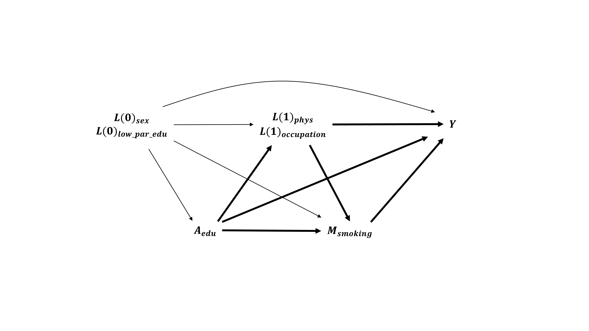

<!-- If you need PDF output, uncomment bookdown::pdf_book above in YAML. You will need a LaTeX installation, e.g., https://yihui.name/tinytex/ -->

```{r required, include=FALSE}
library(r2symbols)
```

# Introduction  

```{r qrcode, echo=FALSE, fig.align="center", out.width="30%", fig.cap="QR code towards the [github repository](https://github.com/chupverse/causal-workshop) of the workshop"}
    
```

We will use the following [data set](https://github.com/benoitlepage/Inserm_workshop_282/blob/main/data/df.csv), you can download the data and import it in R. 

For example, you can create a R project folder for this practical session, add a "data" folder and copy-paste the "df.csv" file in the data folder.

```{r import_data, echo=TRUE}
df <- read.csv2("data/df.csv")
```

## Data generating system
The data generating mechanism is defined by the following set of structural equations, where:

  - baseline confounders are sex ($L(0)_{sex}$, 0 for women, 1 for men) and low parental education level ($L(0)_{low.par.edu}$, 0 for no, 1 for yes),
  - the exposure of interest is the individual's educational level ($A_{edu}$, 0 for high, 1 for low),
  - 2 intermediate confounders affected by the exposure: physical activity ($L(1)_{phys}$, 0 for no, 1 for yes) and occupation ($L(1)_{occupation}$, 0 for non-manual, 1 for manual),
  - the mediator of interest is smoking ($M_{smoking}$, 0 for no, 1 for yes),
  - the outcome $Y$ can be death (0 for no, 1 for yes) or a continuous functional score (higher values correspond to higher function).

$$
\begin{array}{lll}
  L(0)_{sex}         &=& f\left(U_{sex}\right) \\
  L(0)_{low.par.edu} &=& f\left(L(0)_{sex}, U_{low.par.edu}\right) \\
  A_{edu}            &=& f\left(L(0)_{sex}, L(0)_{low.par.edu}, U_{edu}\right) \\
  L(1)_{phys}        &=& f\left(L(0)_{sex}, L(0)_{low.par.edu}, A_{edu}, U_{L(1)_{phys}}\right) \\
  L(1)_{occupation}  &=& f\left(L(0)_{sex}, L(0)_{low.par.edu}, A_{edu}, L(1)_{phys}, U_{L(1)_{occupation}}\right) \\
  M_{smoking}        &=& f\left(L(0)_{sex}, L(0)_{low.par.edu}, A_{edu}, L(1)_{phys}, L(1)_{occupation}, U_{M_{smoking}}\right) \\
  Y                  &=& f\left(L(0)_{sex}, L(0)_{low.par.edu}, A_{edu}, L(1)_{phys}, L(1)_{occupation}, M_{smoking}, U_Y \right) \\
\end{array}$$

```{r figDAGM1, echo=FALSE, out.width="100%", fig.align="center", fig.cap="Causal model 1"}
    
```

Data were simulated using simple logistic and linear models. 

Note that an "exposure - mediator" interaction term is included in the equations to simulate the binary and quantitative outcomes. This will have to be considered during the estimations (in case of exposure-mediator interaction, the results will depend on the choice of estimands: pure or total indirect and direct effects).

```{r data_gen_sys, echo=TRUE}
## The following function can be used to simulate data.frames and estimate
## the "true" Average total effect and controlled direct effects
GenerateData.CDE <- function(N, 
                             inter = rep(1, N), # presence of A*M interaction
                             psi = FALSE) { # FALSE = simulate data.fame only
  ### rexpit function
  rexpit <- function (x) rbinom(length(x), 1, plogis(x))
  
  ### baseline confounders L0
  sex <- rbinom(N, size = 1, prob = 0.45) # 0 = women; 1 = men
  low_par_edu <- rexpit(qlogis(0.7) + log(1.5) * sex) # low parent education
  
  ### exposure A: low educational level = 1
  edu <- rexpit(qlogis(0.5) + log(0.8) * sex  + log(2) * low_par_edu)
  edu0 <- rep(0, N)
  edu1 <- rep(1, N)
  
  ### intermediate counfounders L1
  # physical activity: 1 = yes ; 0 = no
  phys <- rexpit(qlogis(0.6) + log(1.5) * sex  + log(0.8) * low_par_edu +
                   log(0.7) * edu)
  phys0 <- rexpit(qlogis(0.6) + log(1.5) * sex  + log(0.8) * low_par_edu +
                    log(0.7) * edu0)
  phys1 <- rexpit(qlogis(0.6) + log(1.5) * sex  + log(0.8) * low_par_edu +
                    log(0.7) * edu1)
  
  # occupation: 1 = manual; 0 = non-manual
  occupation <- rexpit(qlogis(0.5) + log(1.3) * sex  + log(1.2) * low_par_edu + 
                   log(2.5) * edu + log(2) * phys) 
  occupation0 <- rexpit(qlogis(0.5) + log(1.3) * sex  + log(1.2) * low_par_edu + 
                          log(2.5) * edu0 + log(2) * phys0)  
  occupation1 <- rexpit(qlogis(0.5) + log(1.3) * sex  + log(1.2) * low_par_edu + 
                          log(2.5) * edu1 + log(2) * phys1) 
  
  ### mediator
  smoking <- rexpit(qlogis(0.3) + log(1.8) * sex  + log(1.5) * low_par_edu + 
                      log(2) * edu + log(0.7) * phys + log(1.8) * occupation) 
  smoking0 <- rep(0, N)
  smoking1 <- rep(1, N)
  smoking_tot0 <- rexpit(qlogis(0.3) + log(1.8) * sex  + log(1.5) * low_par_edu + 
                           log(2) * edu0 + log(0.7) * phys0 + log(1.8) * occupation0) 
  smoking_tot1 <- rexpit(qlogis(0.3) + log(1.8) * sex  + log(1.5) * low_par_edu + 
                           log(2) * edu1 + log(0.7) * phys1 + log(1.8) * occupation1) 
                     
  
  ### outcomes
  death <- rexpit(qlogis(0.05) + log(1.5) * sex  + log(1.6) * low_par_edu + 
                    log(1.7) * edu + log(0.8) * phys + log(1.5) * occupation + 
                    log(2.5) * smoking + log(1.5) * edu * smoking * inter)
  death00 <- rexpit(qlogis(0.05) + log(1.5) * sex  + log(1.6) * low_par_edu + 
                      log(1.7) * edu0 + log(0.8) * phys0 + log(1.5) * occupation0 + 
                      log(2.5) * smoking0 + log(1.5) * edu0 * smoking0 * inter)
  death01 <- rexpit(qlogis(0.05) + log(1.5) * sex  + log(1.6) * low_par_edu + 
                      log(1.7) * edu0 + log(0.8) * phys0 + log(1.5) * occupation0 + 
                      log(2.5) * smoking1 + log(1.5) * edu0 * smoking1 * inter)
  death10 <- rexpit(qlogis(0.05) + log(1.5) * sex  + log(1.6) * low_par_edu + 
                      log(1.7) * edu1 + log(0.8) * phys1 + log(1.5) * occupation1 + 
                      log(2.5) * smoking0 + log(1.5) * edu1 * smoking0 * inter)
  death11 <- rexpit(qlogis(0.05) + log(1.5) * sex  + log(1.6) * low_par_edu + 
                      log(1.7) * edu1 + log(0.8) * phys1 + log(1.5) * occupation1 + 
                      log(2.5) * smoking1 + log(1.5) * edu1 * smoking1 * inter)
  death_tot0 <- rexpit(qlogis(0.05) + log(1.5) * sex  + log(1.6) * low_par_edu + 
                         log(1.7) * edu0 + log(0.8) * phys0 + log(1.5) * occupation0 + 
                         log(2.5) * smoking_tot0 + log(1.5) * edu0 * smoking_tot0 * inter)
  death_tot1 <- rexpit(qlogis(0.05) + log(1.5) * sex  + log(1.6) * low_par_edu + 
                         log(1.7) * edu1 + log(0.8) * phys1 + log(1.5) * occupation1 + 
                         log(2.5) * smoking_tot1 + log(1.5) * edu1 * smoking_tot1 * inter)

  score <- rnorm(N, mean = 50 + 5 * sex  -5 * low_par_edu + 
                   -10 * edu + 8 * phys -7 * occupation + 
                   -15 * smoking + -8 * edu * smoking * inter, 
                 sd = 15)
  score00 <- rnorm(N, mean = 50 + 5 * sex  -5 * low_par_edu + 
                     -10 * edu0 + 8 * phys0 -7 * occupation0 + 
                     -15 * smoking0 + -8 * edu0 * smoking0 * inter,
                   sd = 15)
  score01 <- rnorm(N, mean = 50 + 5 * sex  -5 * low_par_edu + 
                     -10 * edu0 + 8 * phys0 -7 * occupation0 + 
                     -15 * smoking1 + -8 * edu0 * smoking1 * inter,
                   sd = 15)  
  score10 <- rnorm(N, mean = 50 + 5 * sex  -5 * low_par_edu + 
                     -10 * edu1 + 8 * phys1 -7 * occupation1 + 
                     -15 * smoking0 + -8 * edu1 * smoking0 * inter,
                   sd = 15)   
  score11 <- rnorm(N, mean = 50 + 5 * sex  -5 * low_par_edu + 
                     -10 * edu1 + 8 * phys1 -7 * occupation1 + 
                     -15 * smoking1 + -8 * edu1 * smoking1 * inter, 
                   sd = 15)   
  score_tot0 <- rnorm(N, mean = 50 + 5 * sex  -5 * low_par_edu + 
                        -10 * edu0 + 8 * phys0 -7 * occupation0 + 
                        -15 * smoking_tot0 + -8 * edu0 * smoking_tot0 * inter, 
                      sd = 15)
  score_tot1 <- rnorm(N, mean = 50 + 5 * sex  -5 * low_par_edu + 
                        -10 * edu1 + 8 * phys1 -7 * occupation1 + 
                        -15 * smoking_tot1 + -8 * edu1 * smoking_tot1 * inter, 
                      sd = 15)
                   
  
  if (psi == FALSE) {
    return(data.sim = data.frame(subjid = 1:N,
                                 sex = sex, 
                                 low_par_edu = low_par_edu,
                                 edu = edu,
                                 phys = phys,
                                 occupation = occupation,
                                 smoking = smoking,
                                 death = death,
                                 score = score))
  } else {
    return(Psi = list(EY00_death = mean(death00),
                      EY01_death = mean(death01),
                      EY10_death = mean(death10),
                      EY11_death = mean(death11),
                      EY0_death = mean(death_tot0), 
                      EY1_death = mean(death_tot1),
                      ATE_death = mean(death_tot1) - mean(death_tot0),
                      CDE0_death = mean(death10) - mean(death00),
                      CDE1_death = mean(death11) - mean(death01),
                      EY00_score = mean(score00),
                      EY01_score = mean(score01),
                      EY10_score = mean(score10),
                      EY11_score = mean(score11),
                      EY0_score = mean(score_tot0),
                      EY1_score = mean(score_tot1),
                      ATE_score = mean(score_tot1) - mean(score_tot0),
                      CDE0_score = mean(score10) - mean(score00),
                      CDE1_score = mean(score11) - mean(score01)))
  }
}


## Simulate the data.frame df 
set.seed(1234)
df <- GenerateData.CDE(N = 10000, inter = rep(1, 10000), psi = FALSE)
summary(df)

## Calculate the "true" estimands for:
##  - the Average total effect: ATE = E(Y_0) - E(Y_1)
##  - the controlled direct effect CDE(M=m), setting the mediator to M=m
##    CDE(M=0) = E(Y_10) - E(Y_00)
##    CDE(M=1) = E(Y_11) - E(Y_01)
set.seed(1234)
true <- GenerateData.CDE(N = 10000, inter = rep(1, 1e6), psi = TRUE) # CHANGE N TO 1e6 ++++++++++
true
```


